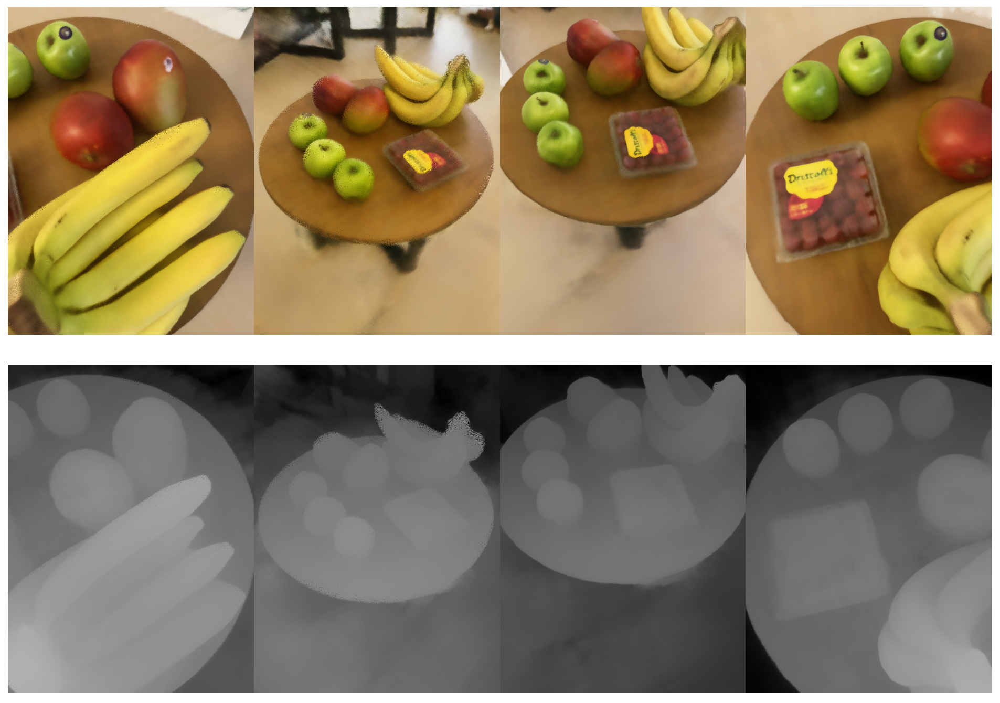
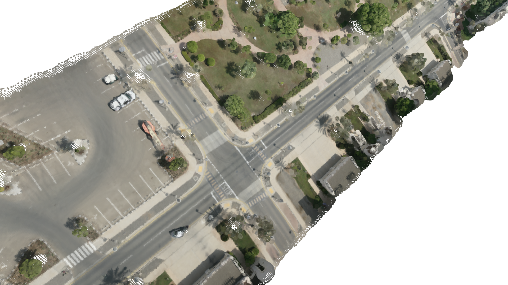
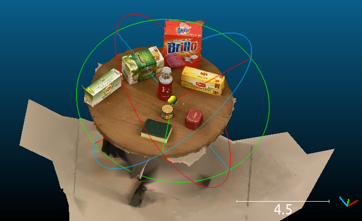

Neural rendering and differentiable rendering have become a popular and powerful toolkit for solving high-quality photorealistic 3D reconstruction and novel viewpoint synthesis. The pain points of neural rendering projects are computational efficiency and the scalability problem of solving large-scale and high-resolution cases, our project tries to improve those, to enable efficient, large-scale photorealistic 3D reconstruction, urban reconstruction, 3D intrinsic decomposition and editing. 

### Efficient High-resolution Depth Rendering

### System Design Key Points

1. Sampling Strategies: uniform sampling, importance sampling, random sampling, selective sampling

   1. selective sampling: based on previous loss and density gradient
2. Coordinate System: unique coordinate `[X, Y, Z]` is `[Right, Down, Forward]`, camera origin is `[0, 0, 0]` in the camera coordinate, thus, ray direction in each pixel is `[u-uc/ focal, v-vc/focal, 1]`.
3. Data Streaming: load everything in CPU RAM and samples, iteratively load batch to CUDA (VRAM), so that can solve any scale of images dataset without occupying VRAM too much. Support different dataset io, colmap, 7-scenes, ScanNet, FalconViz's UAV dataset. 
4. Ray Shuffle: images order and pixel order will shuffle randomly, and thus can improve 3D reconstruction performance.
5. Representation Methods \[Fully Connected MLP, ACORN, NSVF, etc]: support MLP, ACORN, now. (idea: Octree-> arbitrary tree: xgboost boosting tree with objective)
6. Learning Scheduler: support multiple learning rate scheduler, use ReduceLROnPlateau learning scheduler right now. 
7. Multi-GPUs training and rendering
8. Activation Function (relu, rrelu, leaky_relu): there are several activation functions are using in the system, e.g., RGB, density, network output, network layers. Replace ReLu to RReLU for randomized negative density outputs.
9. Helper functions: save results for each epoch(done), save args.

### More results to show:

 

