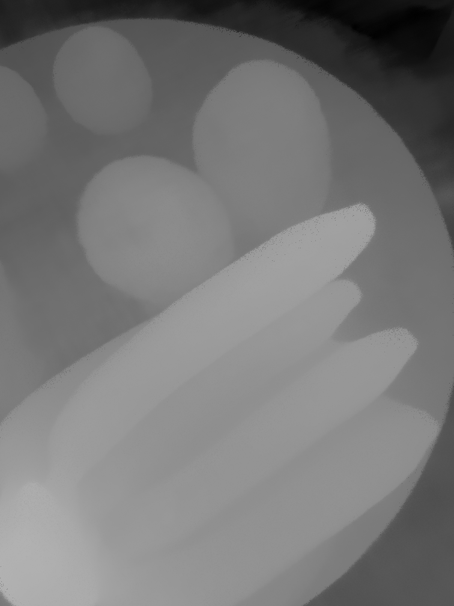

Neural rendering and differentiable rendering have become a popular and powerful toolkit for solving high-quality photorealistic 3D reconstruction and novel viewpoint synthesis. The pain points of neural rendering projects are computational efficiency and the scalability problem of solving large-scale and high-resolution cases, our project tries to improve those, to enable efficient, large-scale photorealistic 3D reconstruction, urban reconstruction, 3D intrinsic decomposition and editing. 

